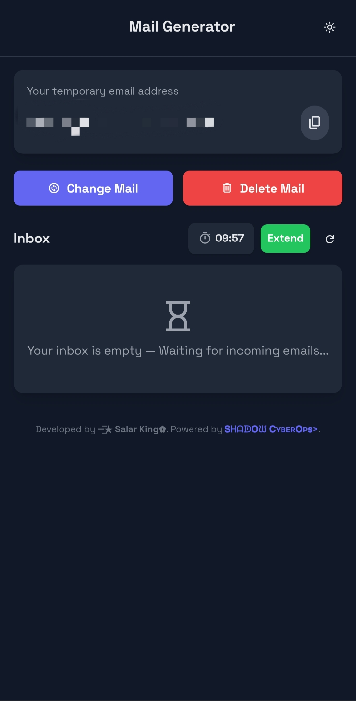

# Temp-Mail

Temp-Mail is a simple open-source temporary email solution designed for developers, testers, and privacy-conscious users.

It allows users to generate disposable email addresses that can be used for testing signup flows, email verification systems, and protecting personal inboxes from spam.

## Features

- Disposable temporary email addresses
- Useful for development and testing
- Helps protect personal email from spam
- Lightweight and easy to use
- Open-source and customizable

## Use Cases

- Testing signup and login systems
- QA testing for email verification
- Protecting privacy when signing up for services
- Development environments

## Usage

1. Open the project in your browser or deploy it online.
2. Generate a temporary email address.
3. Use the address for testing signups or verification flows.
4. View incoming emails in the temporary inbox interface.

## Live Demo

Visit the live project link from the About section of this repository.

## Security

If you find a vulnerability, please check the SECURITY.md file and report it responsibly.


## Screenshot




## Installation

1. Clone the repository

```bash
git clone https://github.com/AnonymousHacker101-Dev/Temp-Mail.git 
